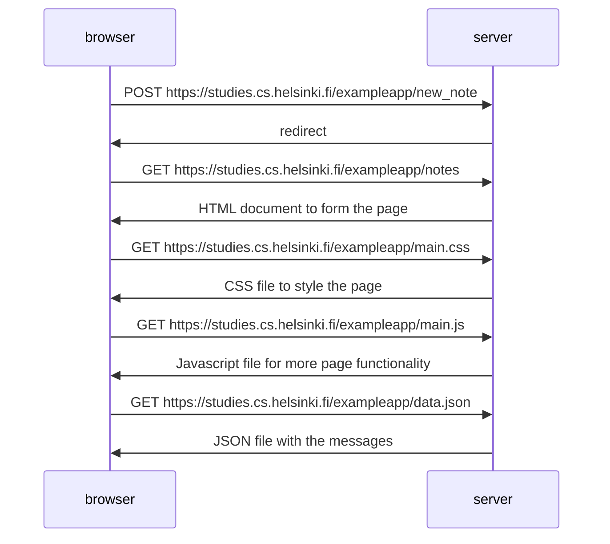

# osan 0 tehtävät
## 0.4

```mermaid
  sequenceDiagram
    participant browser
    participant server
    
    browser->>server: POST https://studies.cs.helsinki.fi/exampleapp/new_note
    server->>browser: redirect

    browser->>server: GET https://studies.cs.helsinki.fi/exampleapp/notes
    server->>browser: HTML document to form the page

    browser->>server: GET https://studies.cs.helsinki.fi/exampleapp/main.css
    server->>browser: CSS file to style the page

    browser->>server: GET https://studies.cs.helsinki.fi/exampleapp/main.js
    server->>browser: Javascript file for more page functionality

    browser->>server: GET https://studies.cs.helsinki.fi/exampleapp/data.json
    server->>browser: JSON file with the messages
```
