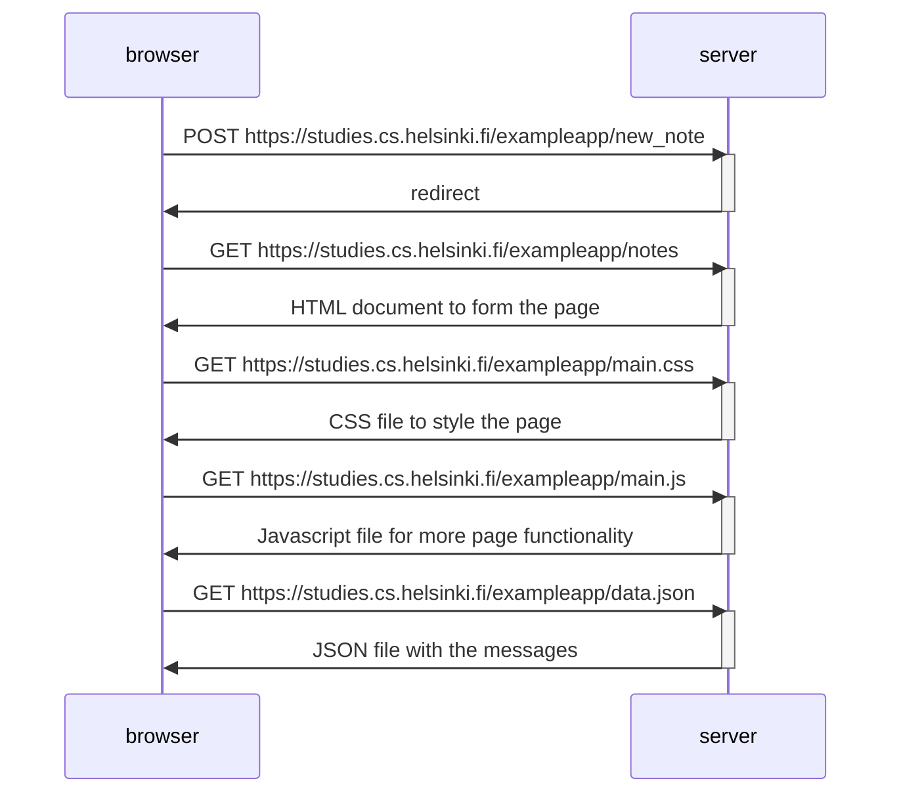
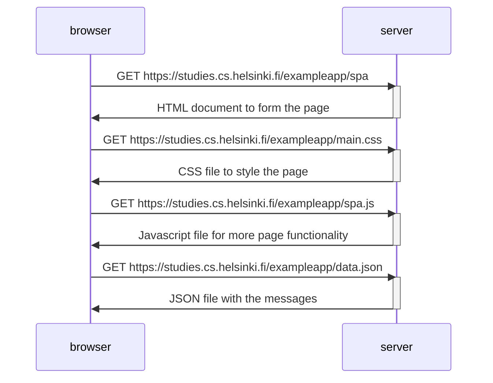
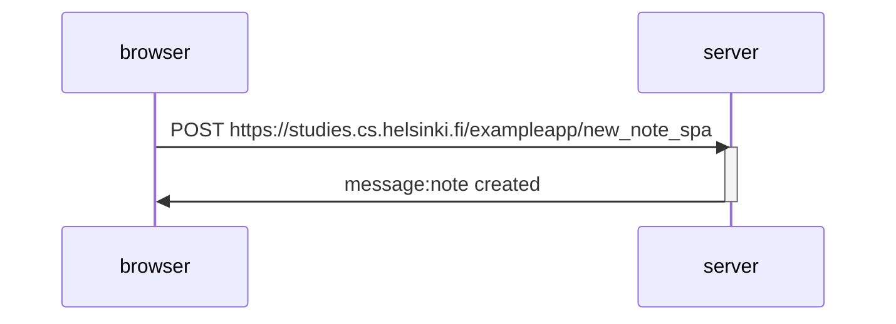

# osan 0 tehtävät
## 0.4

```mermaid
  sequenceDiagram
    participant browser
    participant server
    
    browser->>server: POST https://studies.cs.helsinki.fi/exampleapp/new_note
    activate server
    server->>browser: redirect
    deactivate server

    browser->>server: GET https://studies.cs.helsinki.fi/exampleapp/notes
    activate server
    server->>browser: HTML document to form the page
    deactivate server

    browser->>server: GET https://studies.cs.helsinki.fi/exampleapp/main.css
    activate server
    server->>browser: CSS file to style the page
    deactivate server

    browser->>server: GET https://studies.cs.helsinki.fi/exampleapp/main.js
    activate server
    server->>browser: Javascript file for more page functionality
    deactivate server

    browser->>server: GET https://studies.cs.helsinki.fi/exampleapp/data.json
    activate server
    server->>browser: JSON file with the messages
    deactivate server
```

## 0.5

```mermaid
  sequenceDiagram
      participant browser
      participant server

      browser->>server: GET https://studies.cs.helsinki.fi/exampleapp/spa
      activate server
      server->>browser: HTML document to form the page
      deactivate server
      
      browser->>server: GET https://studies.cs.helsinki.fi/exampleapp/main.css
      activate server
      server->>browser: CSS file to style the page
      deactivate server

      browser->>server: GET https://studies.cs.helsinki.fi/exampleapp/spa.js
      activate server
      server->>browser: Javascript file for more page functionality
      deactivate server

      browser->>server: GET https://studies.cs.helsinki.fi/exampleapp/data.json
      activate server
      server->>browser: JSON file with the messages
      deactivate server

```

## 0.6

```mermaid
  sequenceDiagram
      participant browser
      participant server

      browser->>server: POST https://studies.cs.helsinki.fi/exampleapp/new_note_spa
      activate server
      server->>browser: message:note created
      deactivate server

```
